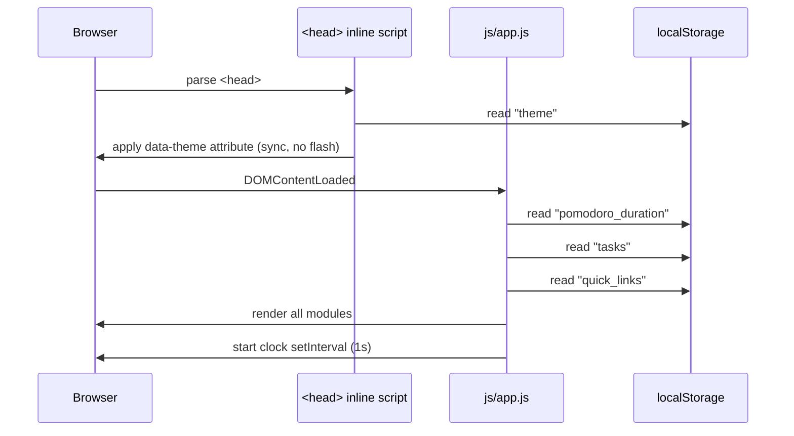

# Design Document: To-Do List Life Dashboard

## Overview

The To-Do List Life Dashboard is a zero-dependency, single-page web application. All logic lives in one HTML file, one CSS file, and one JavaScript file. There is no build step, no module bundler, and no server — the app opens directly from disk in a browser.

The application is organized into four functional modules (Greeting, Timer, Todo, Links) plus two cross-cutting concerns (Theme and Storage). All persistent state lives in the browser's `localStorage`. In-memory state is held in plain JavaScript objects and arrays, and every mutation both updates the DOM and synchronizes to `localStorage` within the required time budgets.

### Design Goals

- **Simplicity**: Plain HTML/CSS/JS. No abstractions beyond what the feature requires.
- **Correctness**: Validation enforced at every write boundary. Storage errors surface gracefully.
- **Performance**: DOM updates are surgical (update only the affected element, not full re-renders), except for the task list sort which re-renders the list container.
- **Theme Flash Prevention**: Theme is applied synchronously in `<head>` before any paint.

---

## Architecture

### Module Interaction Diagram

```mermaid
graph TD
    subgraph DOM
        H[index.html]
        CSS[css/styles.css]
    end

    subgraph JS["js/app.js (single file)"]
        INIT[init()]
        STORAGE[Storage Layer]
        GREETING[Greeting Module]
        TIMER[Timer Module]
        TODO[Todo Module]
        LINKS[Links Module]
        THEME[Theme Module]
        TOAST[Toast Notification]
    end

    H --> JS
    H --> CSS
    INIT --> STORAGE
    INIT --> GREETING
    INIT --> TIMER
    INIT --> TODO
    INIT --> LINKS
    INIT --> THEME
    STORAGE --> TOAST
    TIMER --> STORAGE
    TODO --> STORAGE
    LINKS --> STORAGE
    THEME --> STORAGE
```

### Initialization Sequence



### State Flow

All mutable state is held in a single `appState` object in `app.js`. Every user action goes through a handler that:
1. Validates input
2. Mutates `appState`
3. Calls `persistToStorage(key)`
4. Calls the relevant render function

```
User Action → Handler → validate → mutate appState → persist → render
```

---

## File / Folder Structure

```
project-root/
├── index.html          # Single HTML file; all markup, inline theme script in <head>
├── css/
│   └── styles.css      # All styles; CSS custom properties for theming; media queries
└── js/
    └── app.js          # All JavaScript; module functions namespaced by feature
```

### index.html Responsibilities

- Defines the semantic HTML structure for all four modules
- Contains the inline `<script>` in `<head>` that reads `localStorage("theme")` and sets `data-theme` before first paint
- Loads `css/styles.css` and `js/app.js`

### css/styles.css Responsibilities

- Defines CSS custom properties on `:root[data-theme="light"]` and `:root[data-theme="dark"]`
- Provides all layout (CSS Grid for dashboard panels, Flexbox for rows)
- Responsive breakpoints: `320px` baseline, `768px` tablet, `1200px` desktop

### js/app.js Responsibilities

- `appState`: single source of truth for all in-memory state
- `StorageLayer`: namespaced functions for reading/writing localStorage with try/catch
- Module init functions called on `DOMContentLoaded`
- Event listeners attached once during init

---

## Data Models

### Task Object

```js
{
  id: string,          // crypto.randomUUID() or Date.now().toString() fallback
  title: string,       // 1–200 characters, trimmed
  createdAt: number,   // Unix timestamp ms (Date.now())
  status: "pending" | "completed"
}
```

### QuickLink Object

```js
{
  id: string,          // crypto.randomUUID() or Date.now().toString() fallback
  label: string,       // 1–50 characters, trimmed
  url: string          // must start with "http://" or "https://"
}
```

### In-Memory appState Shape

```js
const appState = {
  tasks: [],              // Task[]
  quickLinks: [],         // QuickLink[]
  pomodoroDuration: 1500, // seconds (integer, 60–5400)
  theme: "light",         // "light" | "dark"
  timer: {
    remaining: 1500,      // seconds remaining
    running: false,       // boolean
    intervalId: null      // setInterval handle | null
  },
  sortOption: "Newest First"  // current sort selection
};
```

### LocalStorage Schema

| Key | Type stored | Default |
|---|---|---|
| `"tasks"` | JSON array of Task objects | `[]` |
| `"quick_links"` | JSON array of QuickLink objects | `[]` |
| `"pomodoro_duration"` | JSON number (integer minutes, 1–90) | `25` |
| `"theme"` | JSON string `"light"` or `"dark"` | `"light"` |

> Note: `pomodoro_duration` is stored in **minutes** but held in memory as **seconds** to simplify countdown arithmetic.

---

## Components and Interfaces

### 1. Greeting Module

**HTML Structure**
```html
<section id="greeting-module">
  <p id="greeting-text">Good Morning</p>
  <p id="current-date">Friday, July 18, 2025</p>
  <p id="current-time">14:05:32</p>
</section>
```

**JS Functions**
```js
function initGreeting()          // attaches setInterval(updateClock, 1000)
function updateClock()           // reads new Date(), updates DOM text nodes
function getGreeting(hour)       // pure: returns greeting string from hour (0–23)
function formatTime(date)        // pure: returns "HH:MM:SS" string
function formatDate(date)        // pure: returns "Weekday, Month Day, Year" string
```

**Greeting Logic**
```
hour 5–11  → "Good Morning"
hour 12–17 → "Good Afternoon"
hour 18–23 → "Good Evening"
hour 0–4   → "Good Evening"
```

`getGreeting` is a pure function: given an integer hour it always returns the same string. This is directly testable.

**Error Handling**: `updateClock` wraps `new Date()` in a try/catch. On failure it sets `#current-time` to `"--:--:--"` and clears `#greeting-text`.

---

### 2. Pomodoro Timer Module

**HTML Structure**
```html
<section id="timer-module">
  <div id="timer-display">25:00</div>
  <div id="timer-controls">
    <button id="timer-start">Start</button>
    <button id="timer-stop">Stop</button>
    <button id="timer-reset">Reset</button>
  </div>
  <div id="duration-controls">
    <button id="duration-decrement">-</button>
    <input id="duration-input" type="number" min="1" max="90" />
    <button id="duration-increment">+</button>
  </div>
  <div id="timer-complete-indicator" hidden>Session complete!</div>
</section>
```

**JS Functions**
```js
function initTimer()                      // reads storage, sets appState.timer, renders
function startTimer()                     // sets interval, clears complete indicator
function stopTimer()                      // clears interval, retains remaining
function resetTimer()                     // clears interval, sets remaining = duration
function tickTimer()                      // decrements remaining; calls onTimerComplete at 0
function onTimerComplete()                // shows indicator, plays alert sound
function setDuration(minutes)             // clamps 1–90, converts to seconds, updates state
function formatTimerDisplay(seconds)      // pure: returns "MM:SS" zero-padded string
function playAlertSound()                 // Web Audio API beep ≤ 3 seconds
```

**Timer State Machine**
```
IDLE ──start──▶ RUNNING ──stop──▶ PAUSED
RUNNING ──tick(0)──▶ COMPLETE
COMPLETE ──start──▶ RUNNING (reset first)
any ──reset──▶ IDLE
```

**Duration Change While Running**: `setDuration` calls `stopTimer()` then `resetTimer()` before applying the new value. Auto-start does NOT happen.

---

### 3. To-Do List Module

**HTML Structure**
```html
<section id="todo-module">
  <div id="todo-add-form">
    <input id="todo-input" type="text" maxlength="200" />
    <button id="todo-add-btn">Add</button>
    <span id="todo-input-error" class="error-msg" hidden></span>
  </div>
  <div id="todo-sort-bar">
    <select id="sort-dropdown">
      <option>Newest First</option>
      <option>Oldest First</option>
      <option>A–Z</option>
      <option>Z–A</option>
      <option>Pending First</option>
      <option>Completed First</option>
    </select>
  </div>
  <ul id="task-list"></ul>
</section>
```

**Task Row (rendered by JS)**
```html
<li data-task-id="{id}" class="task-item [completed]">
  <input type="checkbox" class="task-complete-toggle" />
  <span class="task-title">{title}</span>
  <button class="task-edit-btn">Edit</button>
  <button class="task-delete-btn">Delete</button>
  <!-- edit mode replaces span with: -->
  <input class="task-edit-input" value="{title}" />
  <button class="task-edit-confirm">Save</button>
  <button class="task-edit-cancel">Cancel</button>
</li>
```

**JS Functions**
```js
function initTodo()                       // loads tasks from storage, renders list
function addTask(title)                   // validates, creates Task, persists, re-renders
function editTask(id, newTitle)           // validates, mutates task, persists, re-renders
function toggleTask(id)                   // flips status, persists, updates row class
function deleteTask(id)                   // removes from array, persists, removes row
function sortTasks(tasks, option)         // pure: returns sorted copy of tasks array
function renderTaskList()                 // rebuilds #task-list innerHTML from sorted tasks
function validateTaskTitle(title)         // pure: returns { valid, error }
```

**Sort Logic (`sortTasks`)**

`sortTasks` is a pure function — it takes `(tasks[], option)` and returns a new sorted array without mutating the input.

```
"Newest First"    → sort by createdAt DESC; tie → preserve insertion order
"Oldest First"    → sort by createdAt ASC;  tie → preserve insertion order
"A–Z"             → sort by title.toLowerCase() ASC
"Z–A"             → sort by title.toLowerCase() DESC
"Pending First"   → pending before completed; within each group: insertion order
"Completed First" → completed before pending; within each group: insertion order
```

Tie-breaking is achieved by including the original array index as a secondary sort key.

---

### 4. Quick Links Module

**HTML Structure**
```html
<section id="links-module">
  <div id="links-add-form">
    <input id="link-label-input" type="text" maxlength="50" />
    <input id="link-url-input" type="text" />
    <button id="link-add-btn">Add Link</button>
    <span id="link-input-error" class="error-msg" hidden></span>
  </div>
  <div id="links-limit-msg" hidden>Maximum 50 links reached.</div>
  <div id="links-grid"></div>
</section>
```

**Link Button (rendered by JS)**
```html
<div class="link-item" data-link-id="{id}">
  <a href="{url}" target="_blank" rel="noopener noreferrer">{label}</a>
  <button class="link-delete-btn">×</button>
</div>
```

**JS Functions**
```js
function initLinks()                      // loads from storage, renders grid
function addLink(label, url)              // validates, creates QuickLink, persists, renders
function deleteLink(id)                   // removes from array, persists, re-renders
function renderLinksGrid()                // rebuilds #links-grid; manages limit UI state
function validateLink(label, url)         // pure: returns { valid, errors }
function isValidUrl(url)                  // pure: returns boolean (http/https prefix check)
```

---

### 5. Theme Module

**HTML Structure**
```html
<!-- In <head>, inline script (no defer/async): -->
<script>
  (function() {
    try {
      var t = localStorage.getItem("theme");
      document.documentElement.setAttribute(
        "data-theme",
        (t === "dark" || t === "light") ? t : "light"
      );
    } catch(e) {
      document.documentElement.setAttribute("data-theme", "light");
    }
  })();
</script>

<!-- In header: -->
<button id="theme-toggle" aria-label="Toggle theme">
  <span id="theme-icon">🌙</span>
</button>
```

**JS Functions**
```js
function initTheme()           // reads data-theme already set, syncs appState.theme
function toggleTheme()         // flips between "light"/"dark", updates DOM + persists
```

**CSS Custom Properties**
```css
:root[data-theme="light"] {
  --bg-primary: #ffffff;
  --bg-secondary: #f5f5f5;
  --text-primary: #1a1a1a;
  --text-secondary: #555555;
  --accent: #4a90e2;
  --border: #dddddd;
  --shadow: rgba(0,0,0,0.1);
}

:root[data-theme="dark"] {
  --bg-primary: #1a1a1a;
  --bg-secondary: #2d2d2d;
  --text-primary: #f0f0f0;
  --text-secondary: #aaaaaa;
  --accent: #5aa3f5;
  --border: #444444;
  --shadow: rgba(0,0,0,0.4);
}
```

---

### 6. Toast Notification System

**HTML Structure**
```html
<div id="toast-container" aria-live="polite"></div>
```

**JS Functions**
```js
function showToast(message, durationMs = 5000)
  // creates <div class="toast">, appends to #toast-container,
  // auto-removes after durationMs
```

Toast notifications are non-blocking. They appear in a fixed overlay container and never steal focus.

---

### 7. Storage Layer

```js
const StorageLayer = {
  read(key, defaultValue) {
    try {
      const raw = localStorage.getItem(key);
      if (raw === null) return defaultValue;
      return JSON.parse(raw);
    } catch (e) {
      showToast("Could not read saved data. Using defaults.");
      return defaultValue;
    }
  },
  write(key, value) {
    try {
      localStorage.setItem(key, JSON.stringify(value));
    } catch (e) {
      showToast("Could not save data. Changes may not persist.");
    }
  }
};
```

All four keys (`"tasks"`, `"quick_links"`, `"pomodoro_duration"`, `"theme"`) go through this layer.

---

## Correctness Properties

*A property is a characteristic or behavior that should hold true across all valid executions of a system — essentially, a formal statement about what the system should do. Properties serve as the bridge between human-readable specifications and machine-verifiable correctness guarantees.*

---

### Property 1: Date Formatting Contains All Required Components

*For any* valid `Date` object, `formatDate(date)` must return a string that contains the full weekday name, the full month name, the numeric day of the month, and the four-digit year, all matching the values encoded in the input date.

**Validates: Requirements 1.1**

---

### Property 2: Time Formatting Produces Zero-Padded HH:MM:SS

*For any* valid `Date` object, `formatTime(date)` must return a string that exactly matches the pattern `HH:MM:SS` where HH is zero-padded hours (00–23), MM is zero-padded minutes (00–59), and SS is zero-padded seconds (00–59), all corresponding to the local time components of the input date.

**Validates: Requirements 1.2**

---

### Property 3: Greeting Correctness Across All Hours

*For any* integer hour in the range 0–23, `getGreeting(hour)` must return exactly:
- `"Good Morning"` when hour is in [5, 11]
- `"Good Afternoon"` when hour is in [12, 17]
- `"Good Evening"` when hour is in [18, 23] or [0, 4]

No other return values are permitted for valid inputs.

**Validates: Requirements 1.3, 1.4, 1.5, 1.6**

---

### Property 4: Timer Display Formatting Produces Zero-Padded MM:SS

*For any* integer seconds value in the range 0–5400, `formatTimerDisplay(seconds)` must return a string matching the pattern `MM:SS` where MM and SS are both zero-padded to at least two digits, and the total duration in seconds equals `(MM * 60) + SS`.

**Validates: Requirements 2.1**

---

### Property 5: Duration Clamping Invariant

*For any* numeric input `m` passed to the duration-setting logic, the resulting stored duration must satisfy `1 ≤ result ≤ 90`. Specifically:
- For any `m < 1`, the result must be `1`
- For any `m > 90`, the result must be `90`
- For any integer `m` in [1, 90], the result must equal `m`

**Validates: Requirements 3.4, 3.5**

---

### Property 6: Task Title Validation Correctness

*For any* string `s`, `validateTaskTitle(s)` must return `{ valid: true }` if and only if `s` has a trimmed length between 1 and 200 (inclusive). For any string with a trimmed length of 0 or greater than 200, it must return `{ valid: false }` and the task list must remain unchanged after a rejected add attempt.

**Validates: Requirements 4.1, 4.2**

---

### Property 7: Task Status Toggle Round-Trip

*For any* task in the system, toggling the completion status twice must return the task to its original status. That is, `toggle(toggle(task)).status === task.status`. Furthermore, after a single toggle, the status must be the opposite of the original: pending → completed, completed → pending.

**Validates: Requirements 4.6, 4.7**

---

### Property 8: Task Deletion Removes Task Permanently

*For any* non-empty task list containing a task with a given `id`, calling `deleteTask(id)` must result in a task list where no task with that `id` exists, and the length of the list decreases by exactly one.

**Validates: Requirements 4.8**

---

### Property 9: Sort by Timestamp Orders Tasks Correctly

*For any* non-empty array of tasks:
- `sortTasks(tasks, "Newest First")` must return an array where for every adjacent pair `(tasks[i], tasks[i+1])`, `tasks[i].createdAt >= tasks[i+1].createdAt`
- `sortTasks(tasks, "Oldest First")` must return an array where for every adjacent pair `(tasks[i], tasks[i+1])`, `tasks[i].createdAt <= tasks[i+1].createdAt`

Both operations must not mutate the original array and must preserve all original tasks (same length, same elements).

**Validates: Requirements 5.3, 5.4**

---

### Property 10: Alphabetical Sort is Case-Insensitive and Total

*For any* non-empty array of tasks:
- `sortTasks(tasks, "A-Z")` must return an array where for every adjacent pair, `tasks[i].title.toLowerCase() <= tasks[i+1].title.toLowerCase()`
- `sortTasks(tasks, "Z-A")` must return an array where for every adjacent pair, `tasks[i].title.toLowerCase() >= tasks[i+1].title.toLowerCase()`

Both operations must not mutate the original array.

**Validates: Requirements 5.5, 5.6**

---

### Property 11: Status-Based Sort Groups Tasks Correctly

*For any* array of tasks with mixed statuses:
- `sortTasks(tasks, "Pending First")` must return an array where every pending task appears before every completed task. Within each status group, relative insertion order is preserved.
- `sortTasks(tasks, "Completed First")` must return an array where every completed task appears before every pending task. Within each status group, relative insertion order is preserved.

**Validates: Requirements 5.7, 5.8**

---

### Property 12: Link Validation Correctness

*For any* label string `l` and URL string `u`, `validateLink(l, u)` must return `{ valid: true }` if and only if the trimmed length of `l` is between 1 and 50 (inclusive) and `u` starts with `"http://"` or `"https://"`. For any other combination, it must return `{ valid: false }` and the links list must remain unchanged.

**Validates: Requirements 6.1, 6.2**

---

### Property 13: Link Deletion Removes Link Permanently

*For any* non-empty links list containing a link with a given `id`, calling `deleteLink(id)` must result in a links list where no link with that `id` exists, and the length of the list decreases by exactly one.

**Validates: Requirements 6.4**

---

### Property 14: Storage Round-Trip Preserves All Data

*For any* valid combination of `tasks` array, `quickLinks` array, `pomodoroDuration` integer (1–90), and `theme` string ("light" or "dark"), writing all four values to their respective LocalStorage keys via `StorageLayer.write` and then reading them back via `StorageLayer.read` must return values that are deeply equal to the originals.

**Validates: Requirements 8.1, 3.7, 4.9, 6.5**

---

## Error Handling

### Strategy Overview

Every interaction with `localStorage` is wrapped in a try/catch via `StorageLayer`. All user inputs are validated before any state mutation. The timer handles the edge case of an unavailable system clock gracefully.

### Error Categories and Responses

| Category | Trigger | Response |
|---|---|---|
| `localStorage` write failure | Storage quota exceeded, private browsing, browser restriction | Non-blocking toast: "Could not save data. Changes may not persist." |
| `localStorage` read failure | Corrupt data, browser restriction | Non-blocking toast + fall back to in-memory default |
| Invalid task title | Empty string, >200 chars | Inline error below input; input NOT cleared |
| Invalid task edit | Empty string, >200 chars after edit | Inline error; original title retained |
| Invalid link label | Empty, >50 chars | Inline error; input fields retained |
| Invalid link URL | Missing http/https prefix | Inline error; input fields retained |
| Clock unavailable | `new Date()` throws | Display "--:--:--", clear greeting text |
| Corrupt `pomodoro_duration` in storage | Non-number or out of range | Discard, use 25-minute default |
| Corrupt `theme` in storage | Not "light" or "dark" | Default to "light" |
| Corrupt `tasks` in storage | Not a valid JSON array | Default to `[]`, show toast |
| Corrupt `quick_links` in storage | Not a valid JSON array | Default to `[]`, show toast |

### Toast Notification Design

```
+------------------------------------------+
|  ⚠ Could not save data.                  |
|     Changes may not persist.             |
+------------------------------------------+
```

- Fixed position: bottom-right corner
- Z-index above all content
- Auto-dismisses after 5 seconds
- Multiple toasts stack vertically
- Uses `aria-live="polite"` for screen reader compatibility
- No close button required (auto-dismiss handles it)

### Inline Validation Design

- Error `<span>` sits immediately below the relevant input
- Hidden by default (`hidden` attribute)
- Shown with descriptive message on validation failure
- Cleared when user begins typing again or successfully submits

---

## Testing Strategy

### Dual Testing Approach

Unit tests handle specific examples, edge cases, and integration points. Property-based tests handle universal properties across all valid inputs. Both are necessary — unit tests catch concrete bugs with readable examples, property tests find unexpected edge cases through randomization.

### Property-Based Testing Library

Use **[fast-check](https://fast-check.dev/)** for JavaScript. Fast-check is the standard PBT library for JS/TS, integrates with any test runner (Jest, Vitest), and provides built-in arbitraries for strings, numbers, arrays, and custom generators.

Each property test must run a minimum of **100 iterations**.

Each property test must include a comment tag:
```
// Feature: todo-list-life-dashboard, Property {N}: {property_text}
```

### Property Test Implementation Plan

| Property | Test Description | Arbitraries Needed |
|---|---|---|
| P1: formatDate | Any Date object → contains correct weekday/month/day/year | `fc.date()` |
| P2: formatTime | Any Date object → HH:MM:SS pattern | `fc.date()` |
| P3: getGreeting | Any hour 0–23 → correct string | `fc.integer({ min: 0, max: 23 })` |
| P4: formatTimerDisplay | Any seconds 0–5400 → MM:SS pattern | `fc.integer({ min: 0, max: 5400 })` |
| P5: clampDuration | Any number → result in [1,90] | `fc.integer()` |
| P6: validateTaskTitle | Any string → valid iff trimmed length in [1,200] | `fc.string()` |
| P7: toggle round-trip | Any task → double-toggle = original | Custom task arbitrary |
| P8: deleteTask | Any task list + id → id not present after delete | Custom task list arbitrary |
| P9: sortTasks timestamp | Any tasks array → timestamp sort is monotone | Custom tasks arbitrary |
| P10: sortTasks alpha | Any tasks array → alpha sort is monotone case-insensitive | Custom tasks arbitrary |
| P11: sortTasks status | Any tasks array → status-based sort groups correctly | Custom tasks arbitrary with mixed statuses |
| P12: validateLink | Any (label, url) pair → valid iff constraints met | `fc.string()`, `fc.webUrl()` |
| P13: deleteLink | Any links list + id → id not present after delete | Custom links arbitrary |
| P14: storage round-trip | Any valid appState values → read(write(v)) = v | Custom appState arbitrary |

### Unit Test Plan

**Greeting Module**
- `getGreeting` boundary values: hour 0, 4, 5, 11, 12, 17, 18, 23
- `formatDate` with specific known dates
- `formatTime` with specific known dates
- Clock fallback: mock Date to throw → verify "--:--:--"

**Timer Module**
- Start → verify `running = true`
- Stop → verify `running = false`, remaining unchanged
- Reset → verify `remaining === duration`
- Tick to 0 → verify `running = false`, complete indicator shown
- Start at 0:00 → verify reset first then start
- Duration change while running → verify stop + no auto-start

**Todo Module**
- Add task: verify id, title, createdAt, status fields set correctly
- Edit task: verify title updated, other fields unchanged
- Empty task list renders without error
- Sort with 0, 1, 2 tasks (edge cases)
- Tie-breaking: tasks with identical timestamps → insertion order preserved

**Quick Links Module**
- Add link: verify id, label, url fields set correctly
- Link button has `target="_blank"` and `rel="noopener noreferrer"`
- At exactly 50 links: add button disabled, limit message shown
- At 49 links: add button enabled, limit message hidden

**Theme Module**
- Toggle from light → dark: data-theme changes, icon changes
- Toggle from dark → light: data-theme changes, icon changes
- Default to light when no storage value
- Default to light when corrupt storage value

**Storage Layer**
- `StorageLayer.read` with null value returns defaultValue
- `StorageLayer.read` with invalid JSON returns defaultValue + shows toast
- `StorageLayer.write` with storage error shows toast
- Corrupt `pomodoro_duration` falls back to 1500 seconds

### Responsive Design Testing

- Manually verify at 320px, 768px, 1200px, and 2560px breakpoints
- Verify no horizontal scroll at 320px
- Verify all interactive controls are reachable and operable at all widths

### Cross-Browser Testing

Manually test final implementation on:
- Chrome (current stable)
- Firefox (current stable)
- Edge (current stable)
- Safari (current stable)

Check: no JS errors in console, no layout breaks, Web Audio API beep works.

---

## Responsive Design Strategy

### Layout

The dashboard uses CSS Grid at the top level to arrange the four module panels. Flexbox is used within each module for row-level layout.

```css
/* Mobile-first baseline: 320px+ */
.dashboard-grid {
  display: grid;
  grid-template-columns: 1fr;
  gap: 1rem;
  padding: 1rem;
}

/* Tablet: 768px+ */
@media (min-width: 768px) {
  .dashboard-grid {
    grid-template-columns: 1fr 1fr;
  }
}

/* Desktop: 1200px+ */
@media (min-width: 1200px) {
  .dashboard-grid {
    grid-template-columns: 1fr 1fr 1fr;
    max-width: 1400px;
    margin: 0 auto;
  }
}

/* Wide: 1600px+ */
@media (min-width: 1600px) {
  .dashboard-grid {
    grid-template-columns: repeat(4, 1fr);
  }
}
```

### No Horizontal Overflow

- All elements use `box-sizing: border-box`
- `max-width: 100%` on images and inputs
- `word-break: break-word` on task titles and link labels to handle long text
- `overflow-x: hidden` on `body` as a safety net

### Touch and Pointer Targets

- All interactive controls have a minimum touch target of 44×44px (via padding)
- This ensures usability on 320px mobile screens

---
